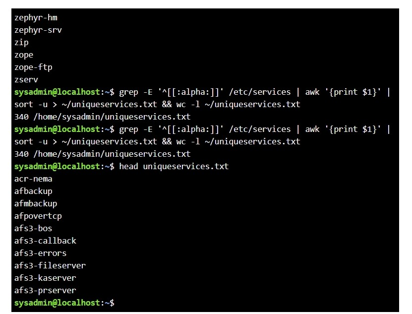

# Service Processing with Pipes and Text Utilities

## Overview

This lab demonstrates how standard Linux command-line utilities can be combined to process structured text from `/etc/services`.

The goal was to extract service names, remove comments and blank lines, sort the results alphabetically, remove duplicate entries, save the output to a file, and count the final number of unique services.

## Objectives

- Read service information from `/etc/services`
- Extract only service names
- Remove comment lines and blank lines
- Exclude lines that do not begin with an alphabetic character
- Sort service names alphabetically
- Remove duplicate entries
- Save the final output to `~/uniqueservices.txt`
- Count the number of unique services
- Use conditional execution so the line count only runs if the pipeline succeeds

## Skills Demonstrated

- Linux text processing
- Regular expressions
- `grep`
- `awk`
- `sort`
- `wc`
- Pipes
- Output redirection
- Conditional execution with `&&`
- File validation
- Working with `/etc/services`

## Key Command

The completed pipeline was:

```bash
grep -E '^[[:alpha:]]' /etc/services | awk '{print $1}' | sort -u > ~/uniqueservices.txt && wc -l ~/uniqueservices.txt
```

## Command Breakdown

The pipeline performs several operations in sequence.

### Filter Valid Service Entries

```bash
grep -E '^[[:alpha:]]' /etc/services
```

This selects only lines that begin with an alphabetic character, filtering out comments and blank lines.

### Extract the Service Name

```bash
awk '{print $1}'
```

This extracts only the first whitespace-separated field from each line, which contains the service name.

### Sort and Remove Duplicates

```bash
sort -u
```

This sorts the service names alphabetically and removes duplicate entries.

### Save the Output

```bash
> ~/uniqueservices.txt
```

This redirects the final service list into the file `uniqueservices.txt` in the user's home directory.

### Count the Results

```bash
wc -l ~/uniqueservices.txt
```

This counts the number of lines in the final file.

### Conditional Execution

```bash
&&
```

The `wc -l` command only executes if the preceding pipeline completes successfully.

## Verification

The resulting file can be inspected with:

```bash
head ~/uniqueservices.txt
```

The total number of unique services can be checked with:

```bash
wc -l ~/uniqueservices.txt
```

The output should contain only service names, with no port numbers, protocols, comments, or duplicate entries.

## Screenshots

### Service Processing Pipeline


