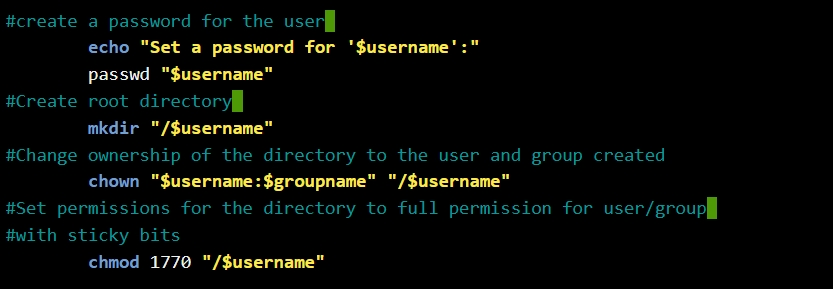
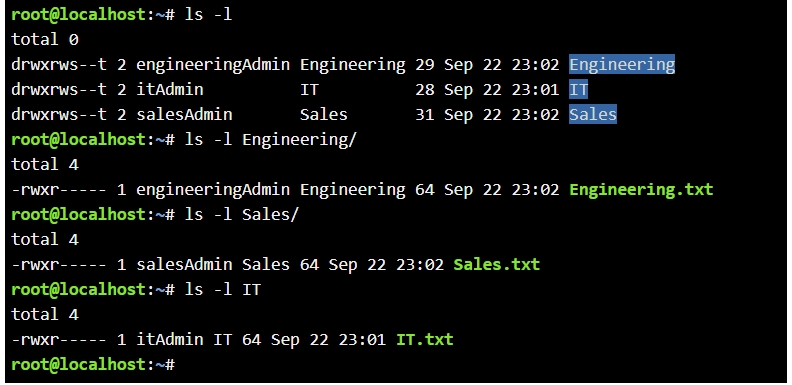

# User Management and Bash Scripting

## Overview

This lab demonstrates Linux user and group administration through a Bash script. The goal was to automate common administrative tasks while validating user input and applying appropriate ownership and file permissions.

## Objectives

- Create a uniquely named Linux group
- Check for an existing group before creating a new one
- Create a uniquely named user
- Check for an existing username before creating a new account
- Create the user's home directory
- Configure Bash as the user's login shell
- Assign the user to the newly created group
- Set a password for the user
- Create a root-level directory matching the username
- Assign ownership of the directory to the new user and group
- Configure read, write, and execute permissions for the owner and group
- Apply the sticky bit to restrict file deletion
- Verify the resulting account, group membership, ownership, and permissions

## Skills Demonstrated

- Bash scripting
- Linux user administration
- Linux group administration
- Variables and user input
- Conditional statements
- Loops
- Command exit-status handling
- User and group validation
- File ownership
- Linux file permissions
- Sticky bit permissions
- Command-line verification

## Key Commands

Some of the primary commands used in this lab include:

```bash
getent group "$groupname"
getent passwd "$username"

groupadd "$groupname"

useradd -m -s /bin/bash -g "$groupname" "$username"

passwd "$username"

mkdir "/$username"

chown "$username:$groupname" "/$username"

chmod 1770 "/$username"

Permission Configuration
The root-level directory created for the user was configured with:
chmod 1770 "/$username"

The permission value 1770 provides:
- 7 — read, write, and execute permissions for the owner
- 7 — read, write, and execute permissions for the group
- 0 — no permissions for other users
- 1 — enables the sticky bit
The sticky bit helps prevent users from deleting files they do not own within a shared writable directory.
Verification
The configuration can be verified using commands such as:
id "$username"

groups "$username"

getent passwd "$username"

getent group "$groupname"

ls -ld "/$username"

ls -ld "/home/$username"

These commands confirm the user account, primary group membership, home directory, ownership, and permissions.
Full Bash Script
The complete Bash script used for this lab is available here:
[View user.sh](./user.sh)
## Screenshots

### Bash Script Logic


### Ownership and Permission Configuration



### Final Permission Verification



